# One Encounter - Cinematic Digital Story

A beautifully animated, personalized digital experience that tells the story of a single, unforgettable moment. Built with Next.js 16, Framer Motion, and Tailwind CSS.

## Screenshots

| Landing | Name Verification | Date Entry | Memory Prompt |
| --- | --- | --- | --- |
| 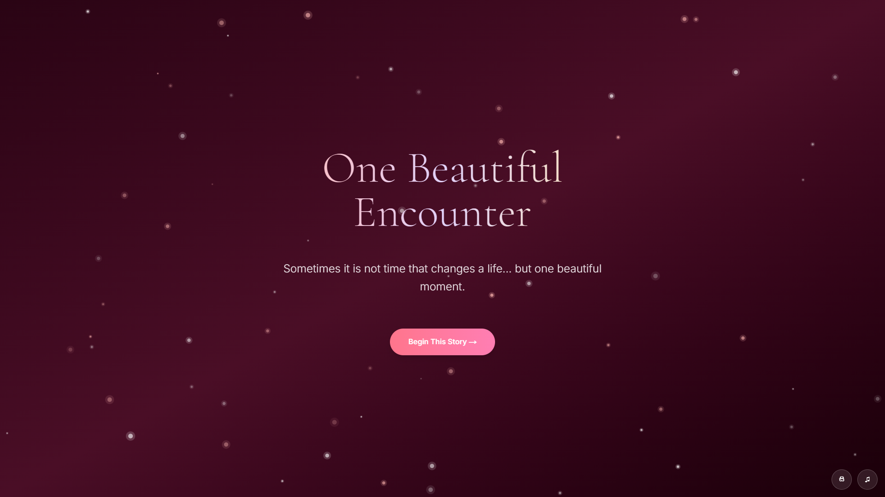 | 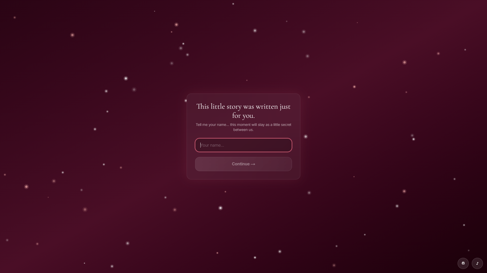 | 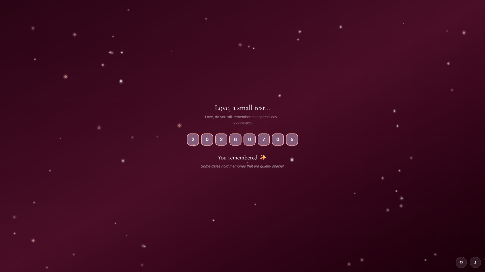 | 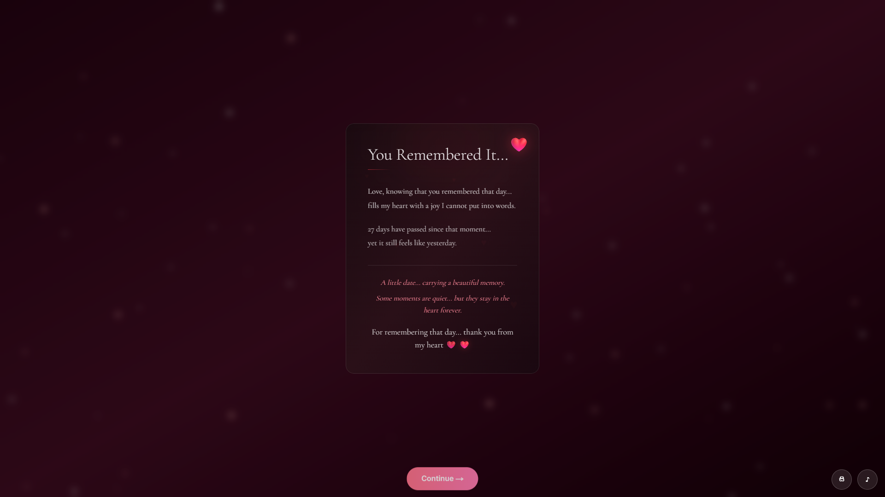 |

| First Meeting | Beauty Moment | Love Message | Closed Letter |
| --- | --- | --- | --- |
| 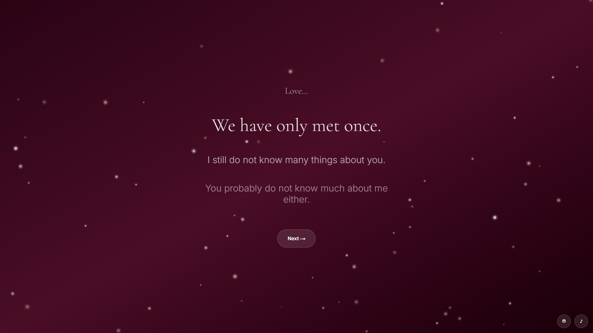 | 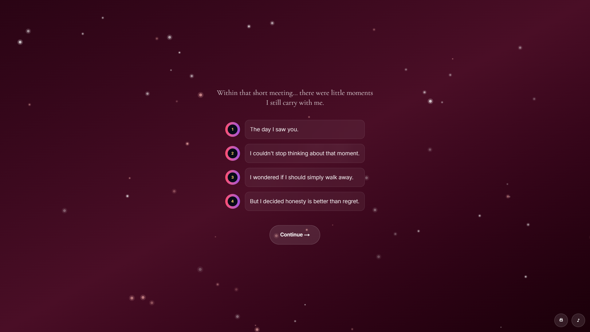 | 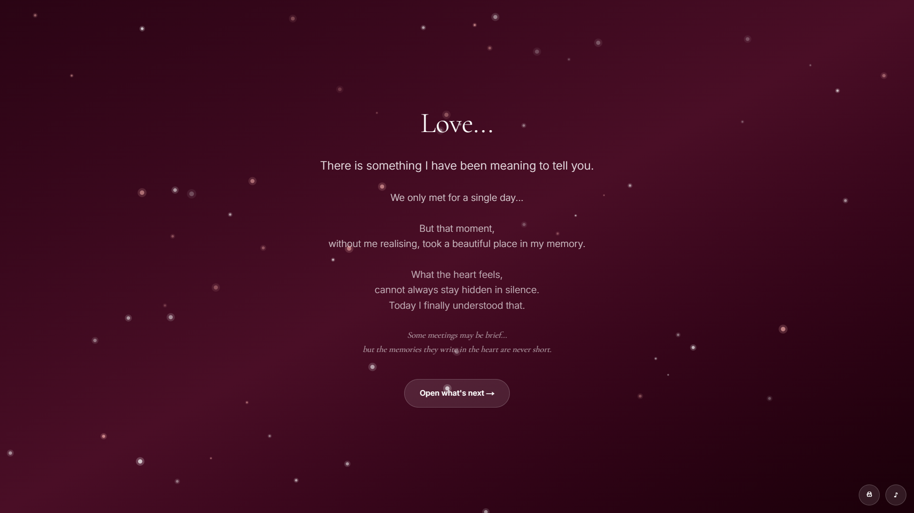 | 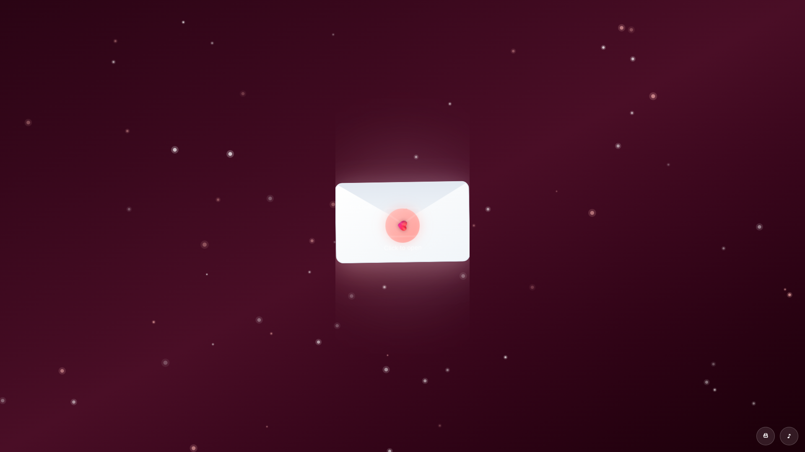 |

| Open Letter | Every Word | Confess | Reply |
| --- | --- | --- | --- |
| 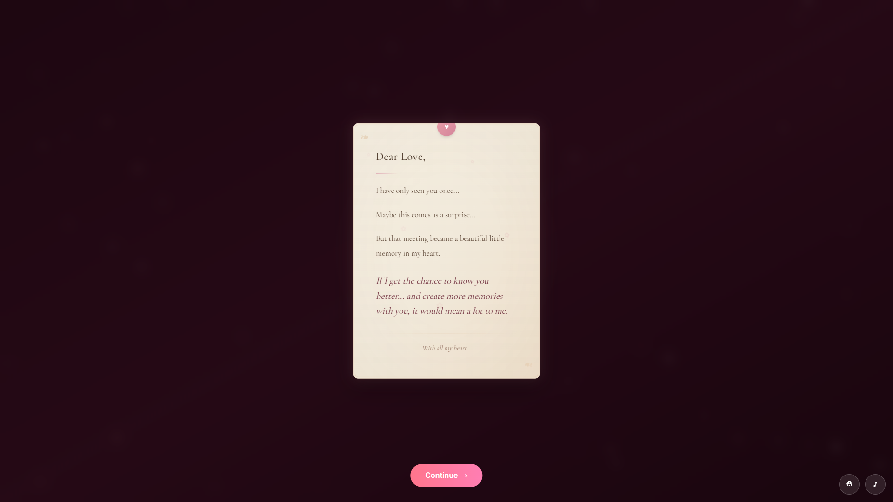 | 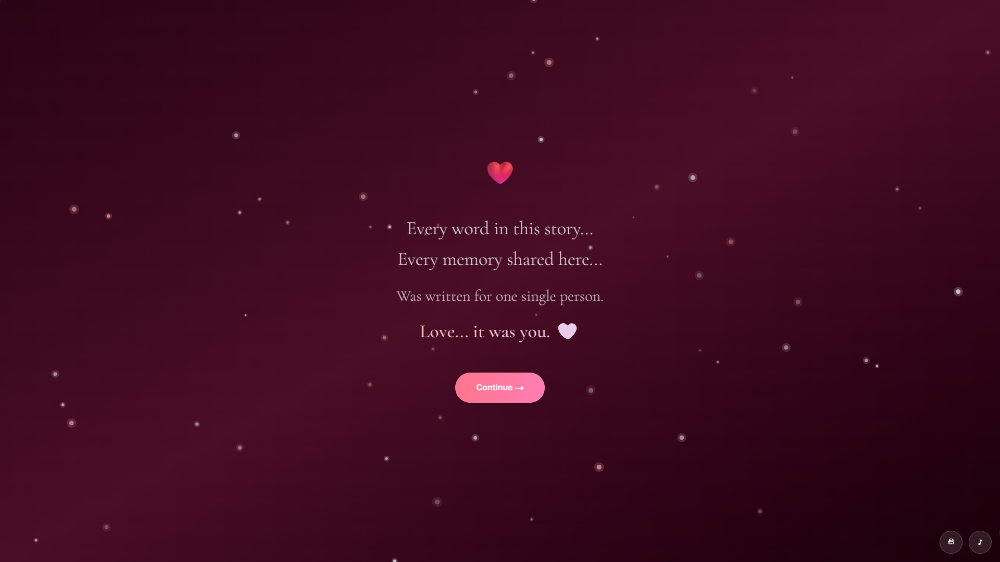 | 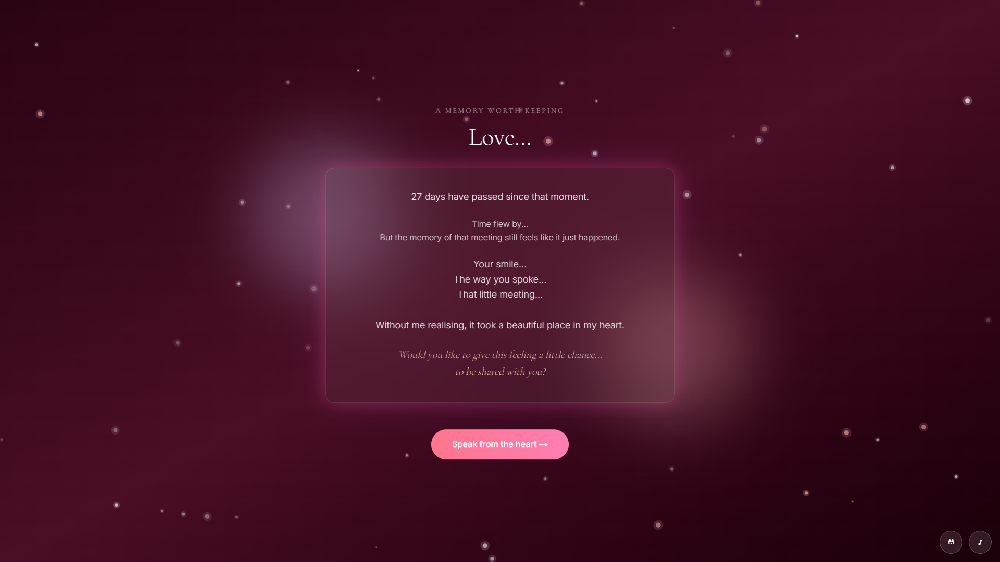 | 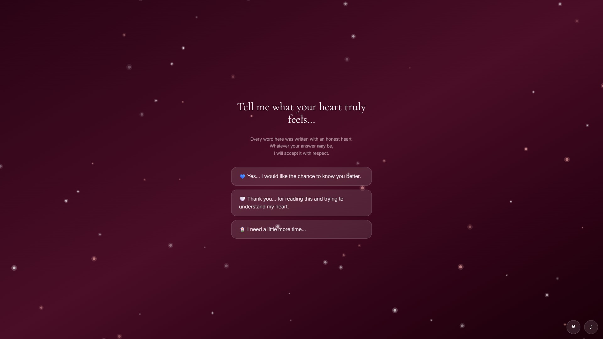 |

**Yes Response**

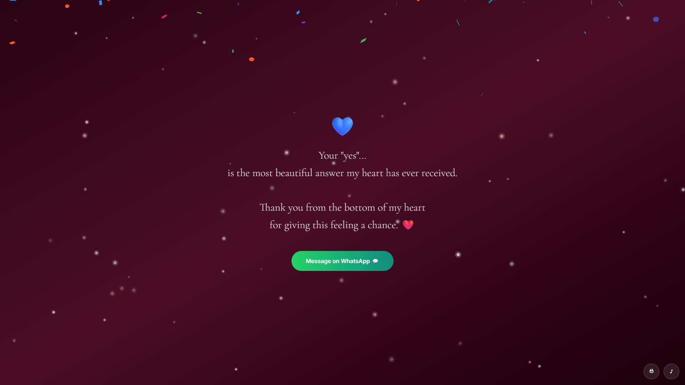

## Features

### Visual Design
- **Dark Cinematic Theme**: Deep midnight background (#070B18) with gradient overlays
- **Glassmorphism UI**: Frosted glass cards with backdrop blur effects
- **Animated Particles**: Canvas-based background particles with aurora gradients
- **Gradient Text**: Premium gradient color combinations (pink #FF4D6D, purple #9D4EDD, gold #FFD166)
- **Smooth Animations**: Framer Motion animations throughout with carefully timed transitions

### Interactive Sections

1. **Loading Screen**: Typewriter effect with animated gradient line
2. **Hero Section**: "One Encounter" title with gradient text and Begin button
3. **Name Verification**: Personalized experience that validates the recipient's name
4. **Chapter 1**: Narrative introduction with staggered text reveals
5. **Chapter 2 - Timeline**: Interactive timeline showing key moments
6. **Chapter 3 - Constellation**: Clickable stars revealing memories and meanings
7. **Envelope Letter**: Animated envelope that unfolds to reveal the message
8. **Final Reveal**: Personalized message with floating heart animation
9. **Memory Scene**: Interactive calendar section with 3 response paths (Yes/Maybe/No)
10. **Response Section**: Emotionally-aware response buttons with unique animations

### Advanced Features

- **Shooting Stars**: Periodic animated shooting stars across the sky
- **Particle Burst**: Celebration particles on "Yes" response
- **Confetti Effect**: Celebrates positive response with full confetti animation
- **Music Button**: Floating music control in top-right corner
- **WhatsApp Integration**: Direct messaging button for positive responses
- **Responsive Design**: Optimized for mobile and desktop viewports
- **Keyboard Navigation**: Enter key support for form submissions
- **Personalization System**: Target name matching with customizable messaging

## Customization

### Setting the Target Recipient

Edit `/lib/constants.ts`:

```typescript
export const TARGET_NAME = 'Zainab' // Change to recipient's name
export const FIRST_MEETING_DATE = new Date('2024-07-05') // When you first met
```

### Customizing Messages

All messages are centralized in `/lib/constants.ts` under the `MESSAGES` object:

```typescript
export const MESSAGES = {
  loading: 'Connecting to a memory...',
  chapter1: 'Your custom message here...',
  envelope: 'Message text...',
  finalReveal: (name: string) => `${name}, custom message...`,
  // ... more messages
}
```

### Constellation Meanings

Customize what each star represents in the constellation:

```typescript
export const CONSTELLATION_MEANINGS: Record<number, string> = {
  0: 'The first moment I saw you',
  1: 'Your smile that changed everything',
  // ... more meanings
}
```

### Timeline Events

Customize the timeline in `TIMELINE_EVENTS`:

```typescript
export const TIMELINE_EVENTS = [
  {
    title: 'First Encounter',
    description: 'The moment everything changed',
    color: '#FF4D6D',
  },
  // ... more events
]
```

### Colors

All colors are defined in `/app/globals.css` as CSS variables:

```css
:root {
  --background: #070B18;
  --primary: #FF4D6D;
  --secondary: #9D4EDD;
  --accent: #FFD166;
}
```

Modify these to change the entire theme's color scheme.

### Music

To add background music, replace the audio src in `app/page.tsx`:

```typescript
<audio
  ref={audioRef}
  loop
  crossOrigin="anonymous"
  src="YOUR_MUSIC_URL_HERE"
/>
```

## Component Structure

```
components/
├── background-particles.tsx    # Canvas particle animation
├── typewriter.tsx              # Text typewriter effect
├── floating-elements.tsx       # Floating stars and hearts
├── glass-card.tsx              # Reusable glassmorphic card
├── timeline-cards.tsx          # Timeline visualization
├── constellation.tsx           # Interactive star map
├── envelope.tsx                # Animated envelope
├── memory-scene.tsx            # Interactive calendar with responses
├── shooting-star.tsx           # Shooting star animation
└── particle-burst.tsx          # Particle celebration effect

lib/
└── constants.ts               # All configuration and messages
```

## Dependencies

- **next**: 16.2.6+ - React framework
- **framer-motion**: Animations and transitions
- **tailwindcss**: Utility-first CSS
- **react-confetti**: Celebration effects
- **lucide-react**: Icons
- **react-intersection-observer**: Scroll animations
- **gsap**: Advanced animations (optional)
- **react-confetti**: Particle effects

## Deployment

The site is ready for deployment on Vercel:

```bash
# Install dependencies
pnpm install

# Build
pnpm build

# Deploy to Vercel
vercel deploy
```

## Animation Performance

All animations use:
- Hardware-accelerated transforms
- Optimized CSS variables
- Lazy-loaded particles
- Efficient re-renders with React optimization

For reduced motion support, add this CSS:

```css
@media (prefers-reduced-motion: reduce) {
  * {
    animation-duration: 0.01ms !important;
    transition-duration: 0.01ms !important;
  }
}
```

## Browser Support

- Chrome/Edge: Full support
- Firefox: Full support
- Safari: Full support (iOS 14+)
- Mobile browsers: Optimized experience

## Accessibility

- Semantic HTML structure
- ARIA labels on interactive elements
- Keyboard navigation support (Enter to submit forms)
- High contrast text on backgrounds
- Screen reader friendly

## Tips for Best Experience

1. **Test on Desktop First**: All animations are optimized for larger screens
2. **Check Your Custom Colors**: Ensure sufficient contrast ratio
3. **Test Name Matching**: Verify the target name check works
4. **Music Volume**: Test audio levels if adding background music
5. **Mobile Testing**: Use responsive design mode in DevTools
6. **Share Responsibly**: This is a personal, intimate experience

## File Size

- HTML: ~15KB
- CSS: ~45KB (Tailwind)
- JavaScript: ~125KB (optimized)
- Total: ~185KB (gzipped)

## License

Personal use only. Not for commercial distribution.

---

Made with love, animated with Framer Motion, and styled with Tailwind CSS.
# confession


